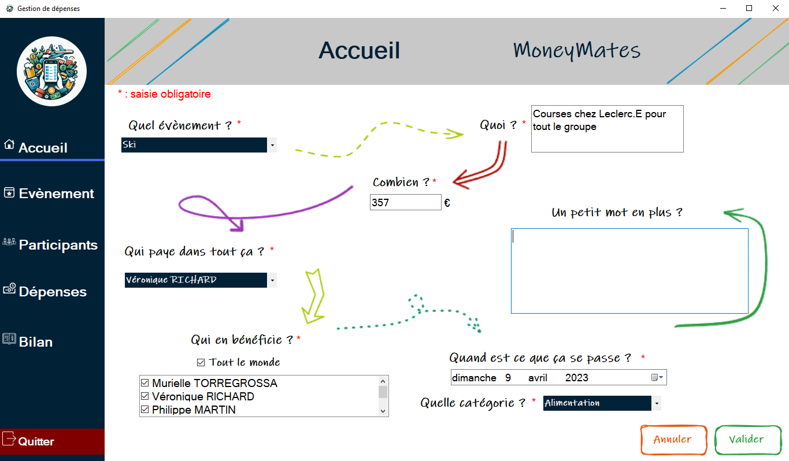
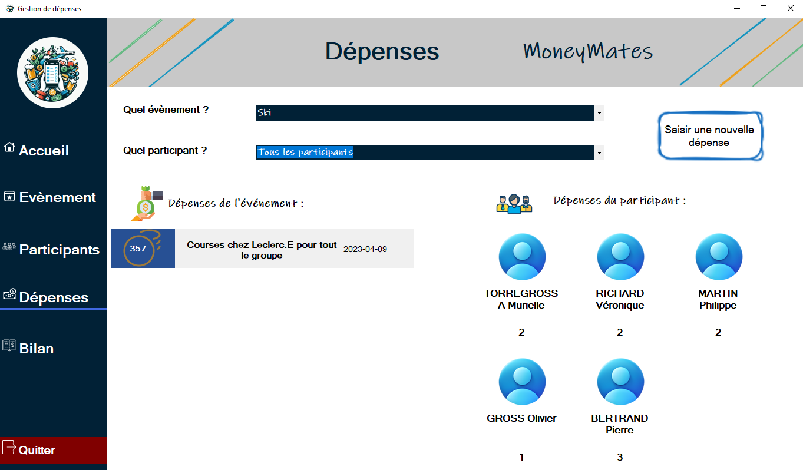

# SAEA21 - Application de Gestion Événementielle

## Table des matières

1. [Description](#description)
2. [Fonctionnalités](#fonctionnalités)
3. [Prérequis](#prérequis)
4. [Installation et utilisation](#installation-et-utilisation)

## Description

SAEA21 est une application de gestion événementielle développée en C#. Elle permet de gérer les événements, les participants et les ressources associées. Ce projet a été réalisé dans le cadre de notre cursus à l'IUT d'Illkirch.

<div align="center">
    
    
</div>

## Fonctionnalités

- Gestion des événements
- Gestion des participants
- Gestion des ressources
- Interface utilisateur intuitive
- Création de bilans au format PDF détaillés, indiquant "Qui doit combien à qui".

## Prérequis

- Visual Studio 2019 ou supérieur
- .NET Framework 4.7.2 ou supérieur
- Le fichier "Events.sql" 

## Installation et utilisation

1. Clonez le dépôt GitHub sur votre machine locale :
   ```bash
   git clone https://github.com/LeDesert/AppGestionEvenementielle.git
   ```
2. Ouvrez le fichier `.sln` avec Visual Studio.
3. ⚠️ Placez le fichier "Events.sql" dans `AppEvenement/bin/Debug` ⚠️ 
4. Compilez et exécutez l'application depuis Visual Studio.

---

# SAEA21 - Event Management Application

## Table of Contents

1. [Description](#description-1)
2. [Features](#features)
3. [Prerequisites](#prerequisites)
4. [Installation and Usage](#installation-and-usage)

## Description

SAEA21 is an event management application developed in C#. It allows managing events, participants, and associated resources. This project was carried out as part of our curriculum at IUT d'Illkirch.

## Features

- Event management
- Participant management
- Resource management
- Intuitive user interface
- Creation of detailed PDF summaries showing "Who owes what to whom".

## Prerequisites

- Visual Studio 2019 or later
- .NET Framework 4.7.2 or later
- The file "Events.sql"

## Installation and Usage

1. Clone the GitHub repository to your local machine:
   ```bash
   git clone https://github.com/LeDesert/AppGestionEvenementielle.git
   ```
2. Open the `.sln` file with Visual Studio.
3. ⚠️ Place the "Events.sql" file in `AppEvenement/bin/Debug` ⚠️
4. Build and run the application from Visual Studio.
